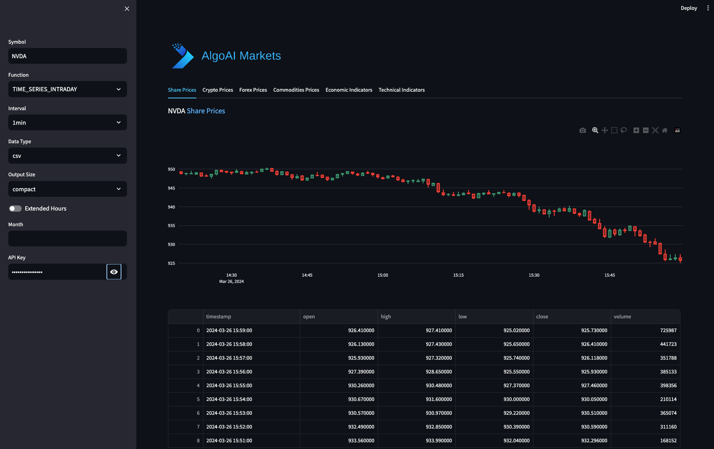

[](https://codecov.io/gh/arturogonzalezm/stock_markets)
[](https://github.com/arturogonzalezm/stock_markets/blob/master/LICENSE)
[](https://github.com/arturogonzalezm/stock_markets/wiki)
[](https://github.com/arturogonzalezm/stock_markets/actions/workflows/workflow.yml)
[](https://github.com/arturogonzalezm/stock_markets)


# Streamlit Financial Data Visualization App

This project is a Streamlit-based web application designed for visualizing various types of financial data. It allows users to interactively select and view data from different financial sectors.

## Overview

The application is structured to allow easy navigation through different data types such as share prices, cryptocurrency rates, forex prices, commodity prices, economic indicators, and technical indicators. It provides a user-friendly interface for financial analysts, traders, and enthusiasts to analyze market trends and make informed decisions.

## Features

- Dynamic data visualization with Streamlit
- Interactive tabs for different types of financial data
- Real-time API requests to fetch the latest financial data
- Customizable settings for data display and analysis

## Setup and Installation

Make sure you have Python 3.10 or later installed on your system. The app relies on several Python libraries such as Streamlit, Pandas, and Requests.

1. Clone the repository to your local machine:

    ```
    git clone https://github.com/arturogonzalezm/stock_markets
    ```

2. Navigate to the cloned directory:

    ```
    cd stock_markets
    ```

3. Install the required Python packages:

    ```
    pip install -r requirements.txt
    ```

4. Run the Streamlit app:

    ```
    streamlit run app.py
    ```
   
White:


Dark:


## Code Explanation

### Memory Management and Warnings

- `tracemalloc.start()`: Initiates tracing of memory allocations in Python.
- `warnings.filterwarnings(...)`: Ignores specific runtime warnings to improve readability.

### Streamlit Configuration

- `setup_page_config()`: Configures the Streamlit page's title, icon, and layout.
- `st.image(...)`: Displays an image at the top of the app, serving as a logo or header.

### Data Tabs

- `display_tabs()`: Sets up interactive tabs for navigating between different financial data types.

### API Requests

- `APIRequest`: An abstract base class designed to handle API requests. It defines a static method `get_data(url)` that fetches data from a specified URL with a 10-second timeout.

### Main Function

- `main()`: The entry point of the Streamlit app, calling functions to set up the page and display content based on user interaction.

## Usage

After starting the app, navigate through the tabs to explore different financial datasets. Input fields and options allow for customization of the displayed data.

## Contributing

Contributions to enhance the functionality and user experience of this Streamlit app are welcome. Please refer to the contributing guidelines for more information.

## License

This Streamlit Financial Data Visualization App is released under the MIT License. See the LICENSE file for more details.

